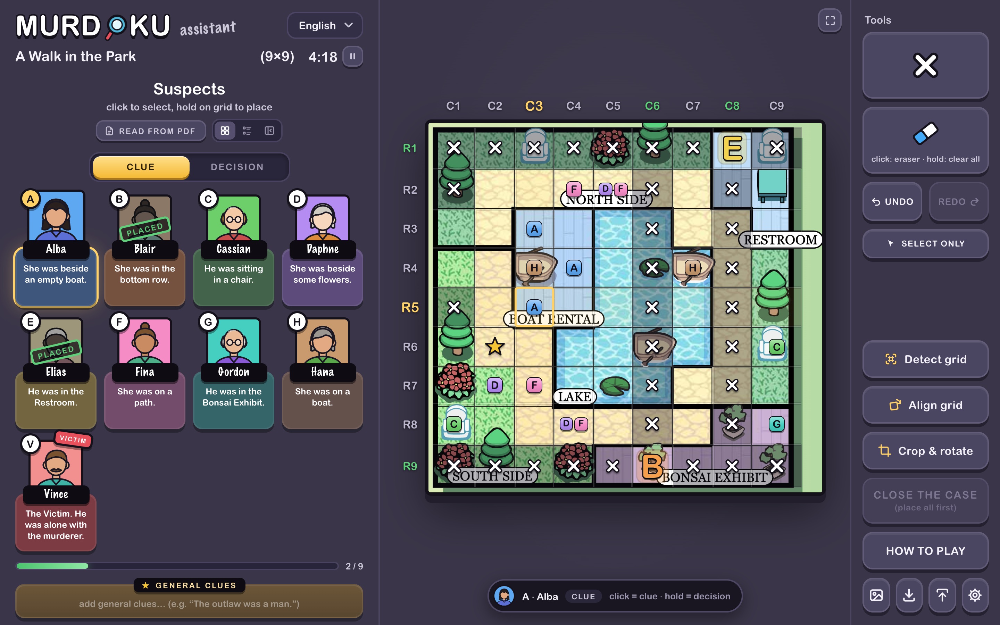

# Murdoku Assistant — User Manual

*Leggi questo in [italiano](MANUALE.md).*

Murdoku Assistant is a digital worksheet for solving **Murdoku** puzzles (murdoku.com): it replaces pen and paper when marking clues and decisions on the crime scene. Give it the puzzle — the **PDF** or a **photo** — and it finds the grid, fills in the suspects and their clues, and keeps track of everything you write. It doesn't solve anything for you and gives no hints.

It's a single, self-contained HTML page: no install, no account, no server, no external libraries or fonts. Just open `index.html` in a desktop browser.

*The app right after loading the PDF of "A Walk in the Park", with a few clues and two decisions placed. Puzzle and artwork by Manuel Garand and Valentyna Bezdushna — [murdoku.com](https://murdoku.com).*

## Contents

1. [What is a Murdoku](#1-what-is-a-murdoku)
2. [Getting started](#2-getting-started)
3. [Loading a puzzle](#3-loading-a-puzzle)
4. [Interface overview](#4-interface-overview)
5. [Fitting the grid to the photo](#5-fitting-the-grid-to-the-photo)
6. [How to play](#6-how-to-play)
7. [Suspects, clues and portraits](#7-suspects-clues-and-portraits)
8. [Keyboard shortcuts](#8-keyboard-shortcuts)
9. [Undo/Redo and the eraser](#9-undoredo-and-the-eraser)
10. [Timer and closing the case](#10-timer-and-closing-the-case)
11. [Export/Import](#11-exportimport)
12. [Autosave and its limits](#12-autosave-and-its-limits)
13. [Language and preferences](#13-language-and-preferences)
14. [Grid sizes and letters](#14-grid-sizes-and-letters)
15. [FAQ](#15-faq)

## 1. What is a Murdoku

A Murdoku is a logic-deduction puzzle: someone has been murdered, and every suspect stands on exactly one square of the crime scene, with **one person per row and one per column** — exactly like non-attacking rooks on a chessboard. Reading each suspect's clue you narrow things down until, for every person, only one possible square remains: that becomes the **decision**. The killer is the one left alone with the victim in the same area.

## 2. Getting started

Open `index.html` by double-clicking it, or "Open with" → your preferred browser. Nothing to install, and no internet connection needed: the app uses no external fonts, scripts or resources.

The app is designed for desktop use with mouse and keyboard. Use an up-to-date browser (Chrome, Edge, Firefox or Safari): reading PDFs needs a reasonably recent one.

## 3. Loading a puzzle

When the page is empty, a card in the middle invites you to load your puzzle. You can **drop a file anywhere on the page**, or use **LOAD PHOTO OR PDF** (the same command is the picture icon at the bottom of the Tools panel).

### From the PDF (recommended)

The free printable puzzles on murdoku.com are PDFs. Drop one on the page, or press **READ FROM PDF** under the "Suspects" title, and in a fraction of a second the app:

- **draws the board** straight from the PDF, crops it and finds its grid;
- reads every **suspect's name and clue**, the **general clues** (numbered, as on the sheet) and the **puzzle title**;
- assigns the **letters**: the victim (the "*X was murdered!*" line) is always **V**, everyone else gets A, B, C… in alphabetical order — on the original sheets the names already start with A, B, C…, so letter and initial match;
- turns on the **portraits**, choosing a man or a woman from the He/She of each clue;
- sets the grid to as many rows and columns as there are people (if the grid already holds marks, it asks first).

Good to know:

- The text on the board (hole numbers, area names…) is drawn with a similar system font, because browsers can't load the fonts embedded in the PDF. The positions are exact and the text stays readable.
- After drawing the board, the app only looks for a grid of the right size (one row and column per person). If it can't see the lines clearly, it places the grid where the PDF says the squares are.
- A case can span several pages: suspects split over two pages, or the board on a page of its own — they're put back together. Decorative vertical labels (like "VISITORS" along the edge) are ignored.
- The board image gets more pixels on big grids (up to about 2000 px for a 24×24), so every square stays sharp at full screen.
- The reader expects the layout of the original sheets: the name under each mugshot and the clue in the bubble below. If a Murdoku sheet is laid out differently and the suspects can't be read, **the board is loaded anyway** and you type names and clues into the cards. A PDF that isn't a Murdoku sheet gets a "Couldn't find the suspects" message and changes nothing.
- If you drop a photo **and** the PDF together, your photo is used as the board and the PDF only provides the suspects.

### From a photo

Drop a photo (or a screenshot) of the puzzle page. The app works out by itself **how many rows and columns** the grid has, **where it is**, **how tilted** it is (up to about ±5°) and even rows and columns of slightly different sizes caused by perspective. It copes with a hand-held phone shot, uneven light and wide page margins. If it isn't sure, it applies nothing and opens the **Align grid** mode so you can fit it by hand (see section 5). Names and clues can then be typed into the suspect cards.

Any common image format works: JPEG, PNG, **HEIC** (the iPhone's default), WebP, AVIF, GIF, BMP, TIFF, and for camera RAW files (DNG, CR2, NEF…) the preview stored inside them. HEIC photos open in Safari, and in Chrome and Edge too (decoded with the computer's video decoder); in browsers that can't decode them you get a message — save the photo as JPEG, or set the iPhone to *Settings › Camera › Formats › Most Compatible*. Photos larger than 2400 px are reduced to that size, which is plenty for the grid and keeps the case light.

### Empty grid

"**or start on an empty grid**" hides the card and lets you play on a plain grid (set rows and columns in **Settings**).

## 4. Interface overview

The layout mirrors the original Murdoku board: suspects on the left, the crime scene in the middle, tools on the right.

- **Left panel — case file and suspects**
  - the logo and the **language** menu;
  - the **case title** (editable), the grid size and the **timer** with its ▶/⏸ button;
  - **READ FROM PDF** and the three **view** buttons (cards, list, hidden — see below);
  - the **CLUE / DECISION** switch;
  - one **card per person**: a big coloured letter (or a portrait, after a PDF), the name, and a bubble with the clue. The victim **V** has a red "VICTIM" ribbon; a card gets a "PLACED" stamp once that person is on the grid;
  - a **progress bar** with how many people are placed;
  - **GENERAL CLUES**, a free text box for clues that apply to everyone;
  - the four **note symbols**.
- **The divider** between the left panel and the board can be dragged to make the board bigger (double-click it to reset). The width is remembered.
- **Suspect views** — the board is as big as the space the panels leave it, so on big grids it pays to shrink the panel:
  - **Cards**: the layout of the original sheet. The default up to 12 people.
  - **List**: one compact row per suspect (letter, name and clue), in a narrow panel. The default above 12 people: a 24×24 board on a 1440×900 screen goes from 23 to 31 px per square.
  - **Hidden**: the panel shrinks to a column of letters (still clickable, with the clue/decision switch and the note symbols); hover a letter to read the name and clue, and the ★ for the general clues. **»** brings the panel back.
  
  The chosen view is remembered in this browser.
- **Full screen**: the button in the top-right corner of the board hides the browser's tabs and address bar (Esc to exit), which on a laptop gives the board about 100 px more.
- **Centre — the crime scene**: the board image with the grid on top, and the `C1…Cn` / `R1…Rn` labels along the edges (only the numbers when squares are small). The row and column of the selected square are highlighted, and a label turns green once its row/column holds a decision. At the bottom, a bar always shows **what the next click will write** (for example "A · Anna — CLUE — click = clue · hold = decision").
- **Right panel — Tools**: the big **✕** (exclusion), the **eraser** (click: eraser tool · hold: clear all), **UNDO / REDO**, **SELECT ONLY**, then **Detect grid**, **Align grid**, **Crop & rotate**, **CLOSE THE CASE**, **HOW TO PLAY**, and four icons: load photo or PDF, export, import, settings.
- **Settings** (gear icon): rows and columns (2–24), remove the photo, reset the timer, and **Start a new case** (clears everything).

## 5. Fitting the grid to the photo

Detection is automatic, but you can always correct it.

- **Detect grid** runs the detection again on the current photo.
- **Align grid** switches to alignment mode (the squares can't be edited meanwhile):
  - drag the box to move it, drag a **corner** to resize it, drag the **round knob** to rotate it;
  - the panel at the top has **ROWS** and **COLUMNS** (− / +), **ROTATION** in 0.1° steps (hold to repeat), **EVEN** (makes all rows and columns the same size again) and **DONE**;
  - from the keyboard: arrows move the box (Shift for bigger steps), `[` and `]` rotate it, Enter or Esc finish.
- **Crop & rotate** opens the photo editor:
  - *Crop & rotate*: drag the frame and its handles to crop, rotate by 90°, straighten with the slider (±45°, with fine ± buttons), **✨ Auto** straightens and crops around the grid by itself, **Reset** starts over;
  - *Perspective*: drag the four yellow corners onto the corners of the board (or let **✨ Find corners** place them), then **Straighten** — useful for photos taken at an angle;
  - **Original photo** goes back to the photo exactly as it was loaded; **APPLY** (or Enter) uses the result, and the grid is detected again.

## 6. How to play

**Pick a tool, then click a square.** The tools are: a suspect (click their card, or press their letter), the **✕**, the **eraser**, or a note symbol. The **CLUE / DECISION** switch decides what a letter does:

- **CLUE mode** — click = **clue** (a small tag meaning "this person *might* be here"; several can share a square). **Hold a square for half a second** to place the person as a **decision** anyway (a ring fills up while you hold).
- **DECISION mode** — click = **decision**.

You can **drag across squares** to put the same clue, ✕ or symbol on many squares at once (the whole stroke is a single undo step). Dragging never places decisions. The **eraser** (one click on its button) empties every square you click or drag over; Delete/Backspace empties the selected square without changing tool. Clicking a square again removes that clue, ✕ or symbol. With **SELECT ONLY** on, clicks just move the selection. Hovering a square shows a transparent preview of what the click will write.

The rules the app applies for you:

- A **decision** puts the person's letter, big, on the square. It's only allowed on a square with no ✕ and no other decision, and each person can be placed only once. When placed:
  - all of that person's clues disappear from the rest of the grid;
  - every other square in the same **row** and **column** gets a ✕ (the "rook rule": one person per row and per column);
  - **a decision can't be removed by clicking it again**: use **Undo**, or the **eraser**, which removes the decision together with the ✕ it had added to its row and column (the ✕ you placed yourself stay).
- The **✕** marks a square where nobody can be. It toggles freely, except on a square holding a decision, and it clears the square's clues and symbol. A square with a ✕ accepts nothing else until you remove the ✕.
- A clue can't be written for a person who has already been placed.
- **Note symbols** (▲ ● ■ ★, keys `1`–`4`) are free annotations — "checked", "come back to this"… They mean nothing to the rules, one per square, and can't go on a square with a ✕ or a decision.

Clues, decisions and symbols use each person's colour, the same one shown on their card. **Holding down a suspect card** highlights every square where that letter appears.

The colours are chosen so that neighbouring letters are clearly different. If two still look alike to you, **hold a suspect's letter (or portrait) for half a second**: a palette opens, with the letter already using each colour marked on it, plus *Custom…* for any colour and *Default* to go back. The new colour shows up straight away everywhere — card, clues and decisions on the board — and is saved with the case.

## 7. Suspects, clues and portraits

Every card has a name field and a clue bubble you can type into (names and clues are filled in automatically from a PDF). Long clues switch to a smaller type and the bubble grows rather than cutting the text. The **GENERAL CLUES** box below the cards grows with its text.

Portraits are **off** by default: each card shows its big letter. They switch on when the suspects come from a PDF, picking a man or a woman from the He/She in the clue — editing the clue so that it says "He" instead of "She" changes the portrait too.

Names, clues and the title are part of the case (they're saved and exported) but they never affect the rules, and typing them never creates an undo step.

## 8. Keyboard shortcuts

| Key | Effect |
|---|---|
| Arrow keys | Move the selected square |
| Letter (`a`…) | Clue for that person in the selected square |
| Shift + letter | Decision for that person in the selected square |
| `x` | Toggle the ✕ on the selected square |
| Delete / Backspace | Empty the selected square |
| `1` – `4` | Apply/remove a note symbol |
| Ctrl/Cmd + Z | Undo |
| Ctrl/Cmd + Y, or Ctrl/Cmd + Shift + Z | Redo |
| Esc | Close the open window |
| While aligning: arrows / `[` `]` | Move the box / rotate it (Shift = bigger steps); Enter or Esc finish |

Shortcuts are ignored while you're typing in a text field (title, names, clues, general clues): there, Ctrl+Z is the text field's own undo.

## 9. Undo/Redo and the eraser

Every change to the grid — ✕, clues, decisions, symbols, a drag stroke, moving/resizing/rotating the grid box, changing the size, clearing — becomes a step in the history. **UNDO** and **REDO** (or Ctrl+Z / Ctrl+Y) move through it. The history lives in memory only and is **lost when the page is reloaded**.

The **eraser** has two gestures:

- **one click** picks the eraser tool: every square you then click or drag over is emptied (✕, clues, symbols, and decisions with the ✕ they had added);
- **holding it for about a second and a half** clears every square at once — a fill shows how long is left. The photo, the grid position, names, clues and the timer stay, and **Undo** brings the squares back.

## 10. Timer and closing the case

The timer starts by itself at your first move on the grid. The ▶/⏸ button next to the title pauses and resumes it; **Reset timer** is in Settings.

When everyone is placed, **CLOSE THE CASE** becomes active: it stops the timer and shows the "CASE CLOSED" stamp with all the suspects and your solving time (and some confetti). The app doesn't know the solution: closing the case doesn't tell you whether you got it right — check against the puzzle's answer. **KEEP LOOKING** goes back to the grid.

## 11. Export/Import

- **Export** asks for a name (the case title by default) and downloads a `.json` file with the whole case: grid size and position, squares, photo, title, names, clues, general clues and portraits. The timer and the undo history are not included.
- **Import** loads such a file, **replacing** the current case after confirmation, and resets the timer. Dropping a `.json` file on the page does the same.

## 12. Autosave and its limits

The case in progress is saved automatically as you go, but the save is **tied to the browser tab** (technically `sessionStorage`, not `localStorage`):

- **Reloading the page (F5) in the same tab**: everything stays exactly as you left it.
- **Opening a new tab or window**, even on the same file: it starts empty — even if another tab still has work in progress.
- **Closing the tab or the browser**: the work is lost, unless you exported it.

The browser gives this save a few megabytes. A board drawn from a PDF fits easily, and photos are reduced to 2400 px on the long side so they normally fit too; if something doesn't, the app tells you ("Storage full"). To keep a case for later, or to switch between cases, use **Export**.

## 13. Language and preferences

The interface starts in **English**; the menu at the top of the left panel switches to **Italiano**. The language and the width of the left panel are remembered in this browser and are independent of the case autosave.

If your system asks for reduced motion, the decorative animations are turned off (the fill of the "hold" gestures stays, because it shows how long is left).

## 14. Grid sizes and letters

Grids go from 2×2 to **24×24**. For the big ones see the suspect views and the full-screen button in section 4: on a laptop, *Hidden* (or *List*) plus full screen gives the board almost the whole screen height. The number of people is `min(rows, columns)`: the victim is always **V** and the others take the letters **A, B, C…** in order. **V** (the victim) and **X** (the exclusion key) are skipped, so after **U** come **W** and **Y**: a 24-person puzzle uses A…U, W, Y and V.

Rows and columns may differ. On a rectangular grid some squares along the longer side necessarily stay without a decision even when the puzzle is solved: that's expected, not a bug.

## 15. FAQ

**I closed the tab and lost my work. Can I get it back?**
No, unless you had exported it. See section 12: export if a case spans more than one session.

**I placed a decision by mistake. How do I remove it?**
Use Undo (Ctrl+Z or the button), or pick the eraser and click it: it goes away together with the ✕ it had added.

**The board is too small (24×24).**
Switch the suspects to *List* or *Hidden* and press the full-screen button in the top-right corner of the board.

**Two suspects have colours that look alike.**
Hold one of the two letters in the suspects panel and pick another colour.

**Why can't I write in a square?**
It has a ✕ (remove it first), it already holds a decision, or that person has already been placed elsewhere. A message at the top of the board says which.

**The grid doesn't line up with the photo.**
Use **Align grid** to move, resize and rotate it by hand, or **Crop & rotate** to straighten the photo (the *Perspective* mode fixes photos taken at an angle). After applying, the grid is detected again.

**My photo won't open.**
HEIC photos need Safari, Chrome or Edge; in other browsers save the photo as JPEG (or set the iPhone camera to *Most Compatible*). For other unusual formats, a JPEG or PNG copy always works.

**My PDF wasn't recognised.**
The reader expects the layout of the original Murdoku sheets. If it's a Murdoku sheet laid out differently, the board is loaded anyway and you type the names and clues in; otherwise take a screenshot of the board and drop it.

**A suspect's name starts with X.**
X is reserved for the exclusion key, so that person gets the next free letter (Y). The card shows their name anyway.

**Why do some people stay "to place" even with a full grid?**
Only on rectangular grids: see section 14.
